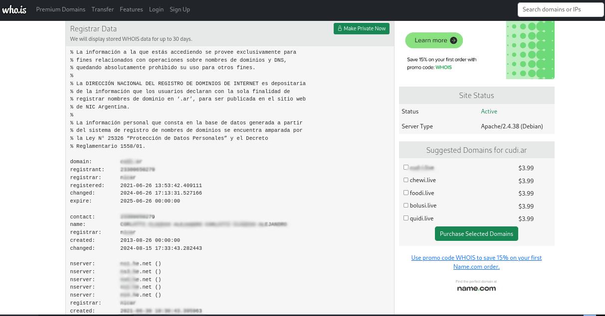
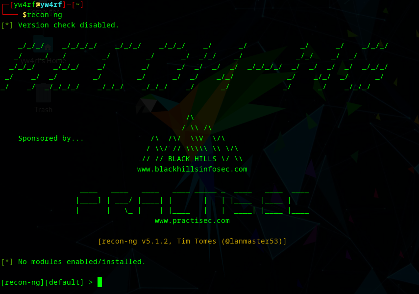
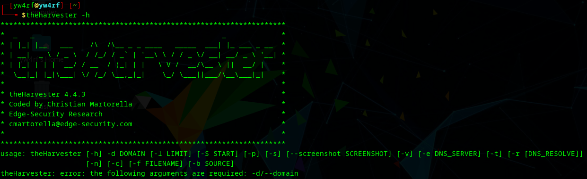

---
title: 'What is Footprinting in Ethical Hacking'
description: "El footprinting es una de las etapas en el proceso de pentesting (pruebas de penetración). Tiene que ver con la recopilación de información sobre un objetivo para identificar posibles vulnerabilidades. En este post, exploraremos en profundidad qué es el footprinting, su importancia y las técnicas utilizadas."
pubDate: 'Oct 8 2024'
categories: ['Pentesting', 'EthicalHacking', 'Cybersecurity']
--- 

> **Disclaimer**:  Este post está destinado únicamente a fines educativos e informativos. La información aquí presentada sobre técnicas de footprinting y otras prácticas de seguridad cibernética no debe ser utilizada para actividades ilegales o malintencionadas. El autor y el sitio web no se hacen responsables de cualquier uso indebido de esta información. Es importante respetar las leyes y regulaciones locales y actuar de manera ética y responsable en el ámbito digital.

## Introducción

El **footprinting** es una de las etapas en el proceso de pentesting (pruebas de penetración). Tiene que ver con la recopilación de información sobre un objetivo para identificar posibles vulnerabilidades. En este post, exploraremos en profundidad qué es el footprinting, su importancia y las técnicas utilizadas.

## ¿Qué es el Footprinting?

El footprinting se refiere a la recopilación sistemática de información acerca de un sistema, red o aplicación. Esta información puede incluir detalles sobre la infraestructura, sistemas operativos, servicios en ejecución, direcciones IP, y más. Se puede dividir en dos tipos principales:

 **Footprinting Activo**: Implica la interacción directa con el objetivo, como escanear puertos y servicios. Esto puede incluir el uso de herramientas como **[Nmap](https://yw4rf.vercel.app/posts/ethical-hacking/network-enumeration-with-nmap)** que envían solicitudes al objetivo para obtener información.

**Footprinting Pasivo**: No involucra la interacción directa con el objetivo. En su lugar, se recopila información a través de fuentes disponibles públicamente, como **redes sociales**, **bases de datos** **WHOIS**, **registros DNS**, y más.

## Técnicas de Footprinting

Existen varias técnicas utilizadas en el footprinting, entre ellas:

### WhoIS Lookup
Whois proporciona datos sobre la registración de un dominio, incluyendo quién lo registró y cómo contactarlos. Es útil para verificar la disponibilidad de un dominio y para la investigación de redes.

 **Información Común Proporcionada**: Al realizar una búsqueda Whois, es posible obtener varios tipos de información: 
 
 **Nombre del registrante**: Persona o entidad que ha registrado el dominio.
 **Información de contacto**: Dirección, correo electrónico y número de teléfono del registrante.
 **Fechas**:
    - **Creación**: Cuándo se registró el dominio.
    - **Expiración**: Cuándo vence el registro.
    - **Última actualización**: Fecha de la última modificación en la información del dominio.
 **Servidores de nombres (NS)**: Indican dónde se alojan los registros DNS del dominio.
 **Estado del dominio**: Indica si el dominio está activo, bloqueado, etc.

 Existen servicios web que ofrecen busquedas WhoIS como **[Who.IS](https://who.is)**, **[ICANN](https://lookup.icann.org)**,  **[DomainTools](https://whois.domaintools.com/)**, entre otras. Aunque es posible usar WhoIS por la terminal. 

### DNS Interrogation
El "DNS Interrogation" implica consultar el Domain Name System (**DNS**) para obtener información sobre un dominio. Se utilizan herramientas como **nslookup** y **dig** para acceder a registros DNS, como **A (direcciones IPv4)** , **AAAA (direcciones IPv6)**, **MX (servidores de correo)**, **TXT (información adicional)** y, en algunos casos, realizar transferencias de zona (una técnica donde un atacante intenta obtener una copia completa de la base de datos DNS de un dominio)

### Social Engineering
La ingeniería social (social engineering) es una técnica de manipulación utilizada para engañar a las personas con el fin de que divulguen información confidencial o realicen acciones que comprometan la seguridad. Generalmente, se basa en la explotación de la psicología humana, en lugar de vulnerabilidades técnicas. Algunos métodos comunes utilizados en la ingeniería social son:

**Phishing**: Envío de correos electrónicos o mensajes que parecen legítimos para robar credenciales o información personal.

**Pretexting**: Creación de un escenario falso para obtener información específica de la víctima.

**Baiting**: Ofrecer un incentivo, como un software gratuito, que contiene malware.

**Tailgating**: Seguir a alguien autorizado para acceder a áreas restringidas.

### Google Hacking
El Google Hacking, también conocido como "Google Dorking", es una técnica que utiliza consultas avanzadas en el motor de búsqueda de Google para encontrar información específica que no está fácilmente accesible. Esto incluye datos sensibles, archivos expuestos y configuraciones de sistemas.

Utilizan **Operadores de Búsqueda** avanzada, como `filetype:`, `site:`, `intitle:`, y otros, para filtrar resultados. Por ejemplo, `filetype:pdf "confidencial"` buscaría archivos PDF que contengan la palabra "confidencial". [Cheatsheet Google Dorking](https://github.com/chr3st5an/Google-Dorking)

## Herramientas Comunes

El footprinting se puede realizar utilizando diversas herramientas, entre ellas:

### Nmap
**[Nmap](https://yw4rf.vercel.app/posts/ethical-hacking/network-enumeration-with-nmap)** es una herramienta de código abierto utilizada para explorar redes y realizar auditorías de seguridad. Su capacidad para detectar dispositivos conectados, identificar puertos abiertos y determinar servicios en ejecución la convierte en una herramienta esencial para profesionales de la ciberseguridad. **[Nmap cheatsheet](https://yw4rf.vercel.app/posts/ethical-hacking/network-enumeration-with-nmap)** 

### Maltego
**Maltego** es una herramienta de inteligencia y análisis de datos utilizada principalmente en el ámbito de la ciberseguridad y la investigación forense. Se utiliza para recopilar, visualizar y analizar información sobre individuos, organizaciones y dominios a partir de diversas fuentes de datos públicas.

### Recon-ng
**Recon-ng** es una herramienta de recopilación de información (reconocimiento) diseñada para llevar a cabo análisis de inteligencia de fuentes abiertas (OSINT). Su enfoque principal es facilitar la recopilación y organización de datos sobre objetivos específicos, como dominios, direcciones IP o personas.

### The Harvester
**The Harvester** es una herramienta de recopilación de información. Su propósito principal es ayudar a obtener datos sobre direcciones de correo electrónico, nombres de usuario, subdominios y otros detalles relacionados con un dominio específico a partir de diversas fuentes en línea.

### Conclusión

El footprinting es una fase fundamental en el pentesting que permite comprender mejor el entorno del objetivo. A través de la recopilación efectiva de información, se pueden identificar vulnerabilidades y planificar estrategias de ataque más eficientes.

 