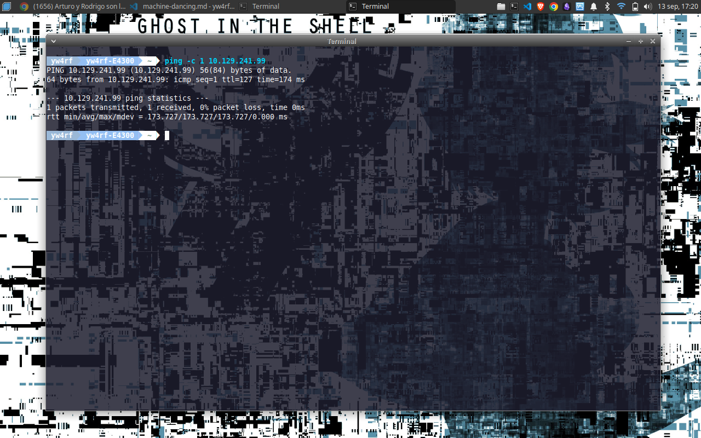
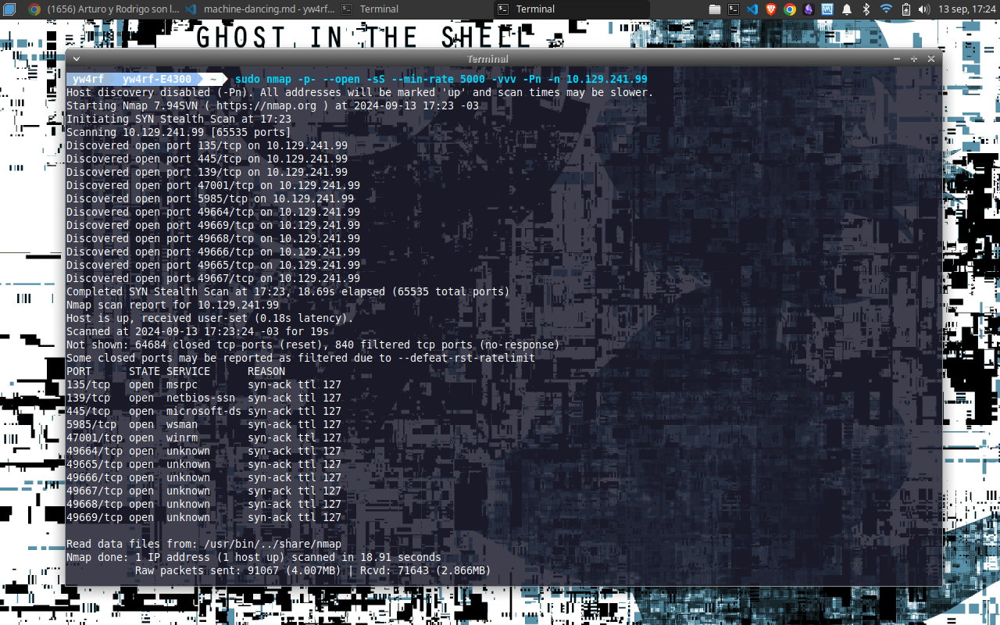
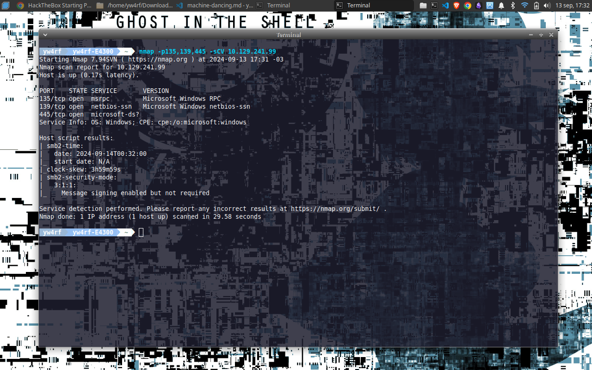
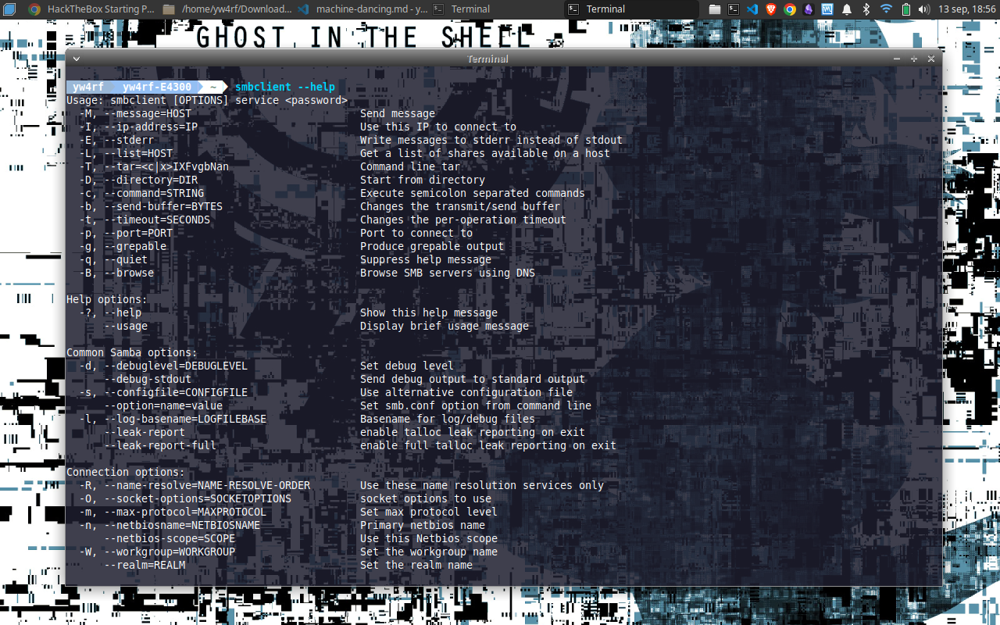
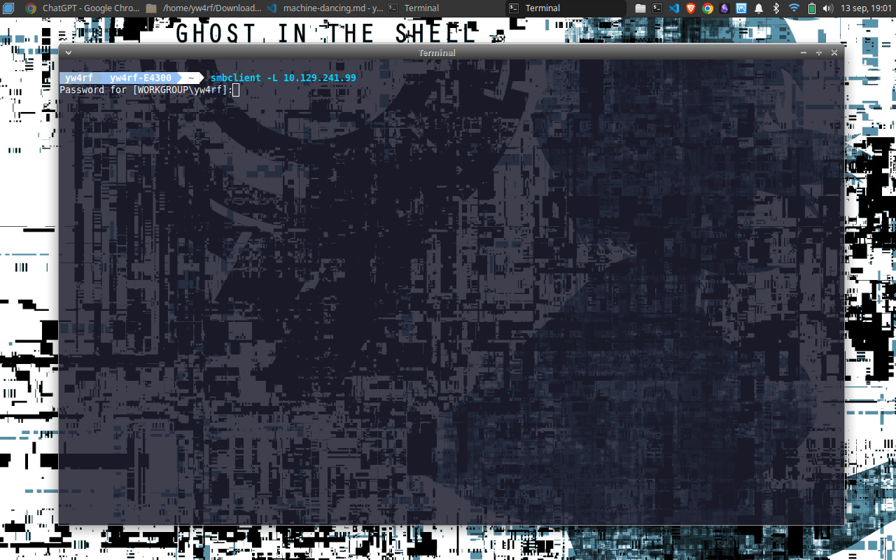
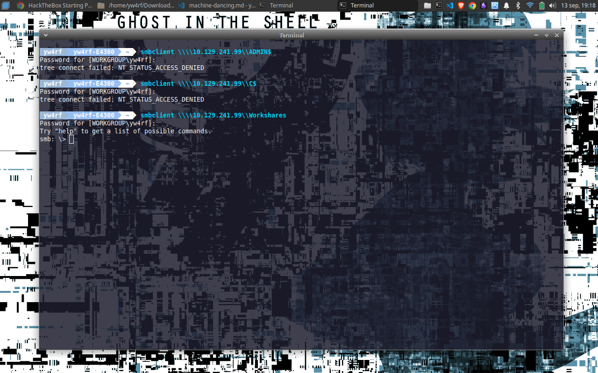
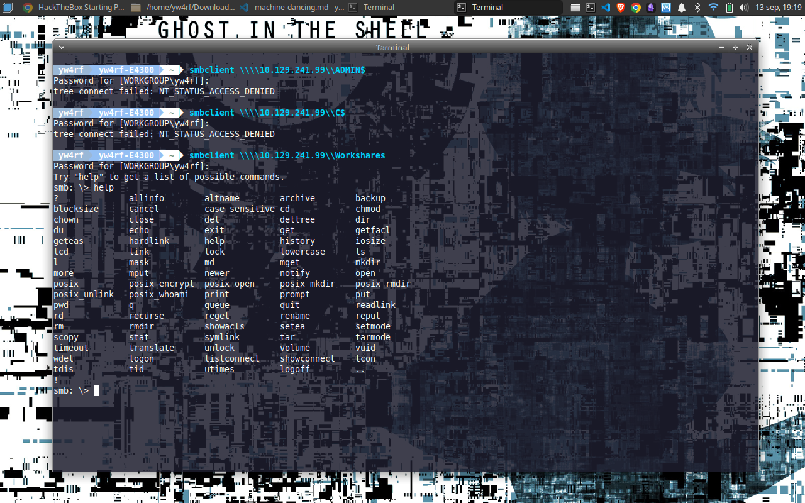
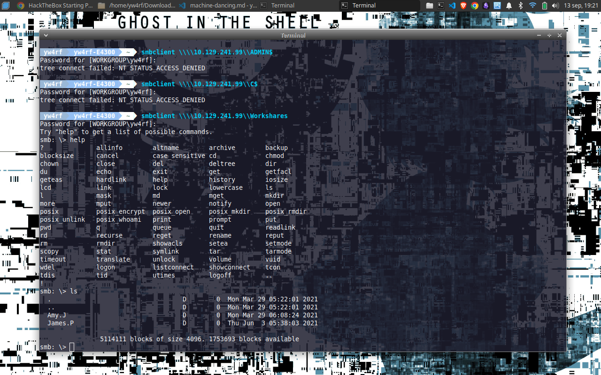
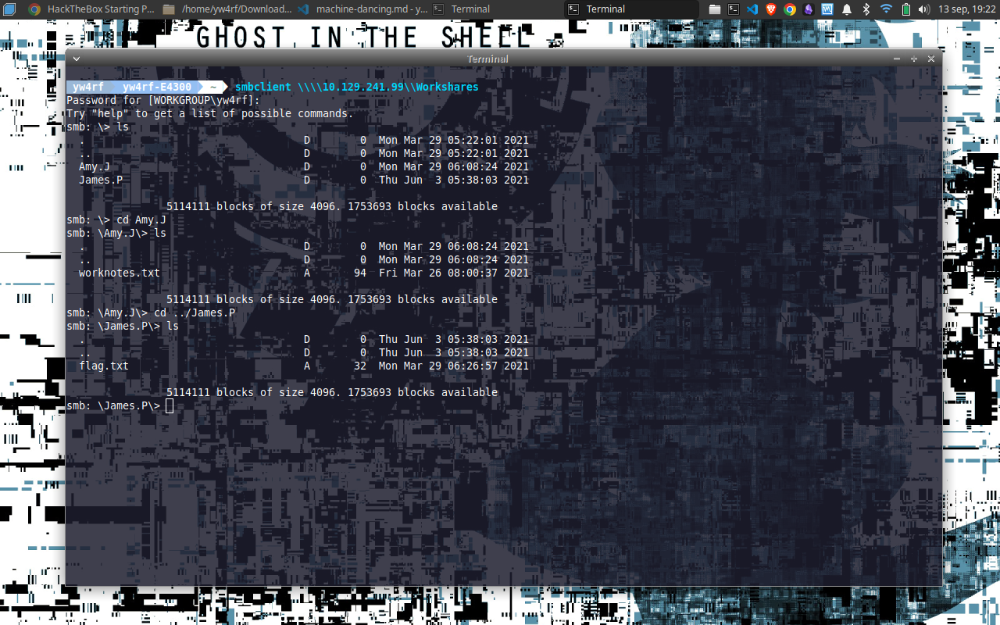
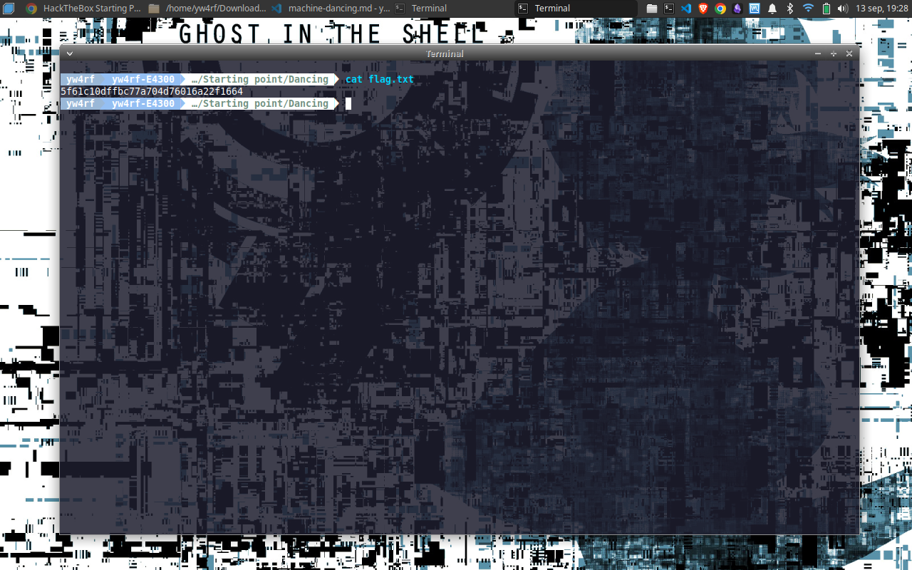

---
title: 'Dancing - HTB'
description: "En este write-up, utilizaremos Nmap para escanear puertos e identificar puertos abiertos y servicios, enfocándonos en SMB. Enumeraremos, y descargaremos la flag."
pubDate: 'Sep 5 2024'
categories: ['WriteUp', 'HackTheBox', 'CTF']
--- 

## Introducción

En este write-up, utilizaremos Nmap para escanear puertos e identificar puertos abiertos y servicios, enfocándonos en el SMB. Enumeraremos, haremos uso de credenciales debiles y descargaremos la flag.

```
Platform: Hack The Box
Level: Very Easy
```


## Enumeración 

```
Target: 10.129.241.99
```
<br>

Primero confirmamos conectividad con la maquina con `ping -c 1 {target ip}`



Luego de confirmar la conexión, procedemos a escanear al objetivo mediante **Nmap**. 



Luego de hacer el escaneo vemos varios puertos abiertos, los que mas llaman la atención son los 3 primeros, el `135/tcp`, `139/tcp` y el `445/tcp`. Haremos un escaneo de puertos mas especifico a esos puertos para verificar que servicios y que version corren.



## 445 SMB

Con una rapida busqueda en Google podemos ver que **"El Server Message Block (SMB) protocolo, que se encuentra en el puerto 445 es un modelo cliente-servidor, está diseñado para regular el acceso a archivos, directorios y otros recursos de red como impresoras y enrutadores. Los recursos compartidos, que representan partes arbitrarias del sistema de archivos local, pueden ser proporcionados por un servidor SMB, haciendo que la jerarquía sea visible para un cliente en parte independiente de la estructura real del servidor."**
[fuente: HackTricks](https://book.hacktricks.xyz/v/es/network-services-pentesting/pentesting-smb)

Como podemos ver `445/tcp` para `SMB` está en funcionamiento, esto significa que tenemos un servicio de recursos compartidos operando.

Es posible utilizar un script llamado `smbclient` para enumerar el contenido de los recursos compartidos en el objetivo. Utilizamos `smbclient --help` para ver las posibles flags



La que nos interesa es `-L` ya que nos da una lista de los hosts del objetivo. Escribimos `smbclient -L 10.129.241.99`

`smbclient` va a intentar conectarse al host objetivo y comprobará si se requiere alguna autenticación. Como no sabemos el nombre de usuario este usará el predeterminado de nuestra maquina, luego pondremos cualquier contraseña.



Nos mostrara: 

```
ADMIN$ = Es una carpeta compartida administrativa que proporciona acceso remoto al sistema de archivos de Windows. Es un recurso oculto (los recursos compartidos ocultos suelen tener un signo de dólar $ al final de su nombre) que da acceso a la carpeta Windows o al directorio raíz de Windows en el sistema.

C$ = : Es un recurso compartido administrativo que da acceso al disco C: de forma remota.

IPC$ = Es un recurso compartido especial utilizado para compartir canales de comunicación entre procesos. No contiene archivos en sí, pero se usa para intercambiar información entre el cliente y el servidor durante una sesión SMB

WorkShares = Es un nombre genérico que se refiere a recursos compartidos personalizados por los usuarios o la administración del sistema.
```


Intentaremos conectarnos a `ADMIN$`, `C$` y `Workshares`. Dejamos de lado `IPC$` ya que esté no contiene archivos ni información directamente útil, como vimos anteriormente, tiene como objetivo específico la comunicación y no el almacenamiento.

Usaremos como USERNAME el default (osea el de nuestra maquina) y la contraseña en blanco.

Lo haremos mediante el siguiente comando: `smbclient \\\\{target ip}\\{nombre del recurso compartido}`



Luego de probar todos, logramos entrar a `Workshares`. Usamos el comando `help` para ver una lista de los posibles comandos

Como vemos es posible utilizar `ls` para enlistar 



Podemos ver que hay 2 carpetas, `Amy.J` y `James.P`, podemos entrar en ellas con el comando `cd`



La carpeta `Amy.J` contiene el archivo **worknotes.txt** y `James.P` contiene el archivo `flag.txt`. Los dos archivos pueden descargarse mediante el comando `get {file_name}`



Una vez descargada la flag podriamos abrirla con el comando `cat`



Ya tendriamos la maquina hecha

